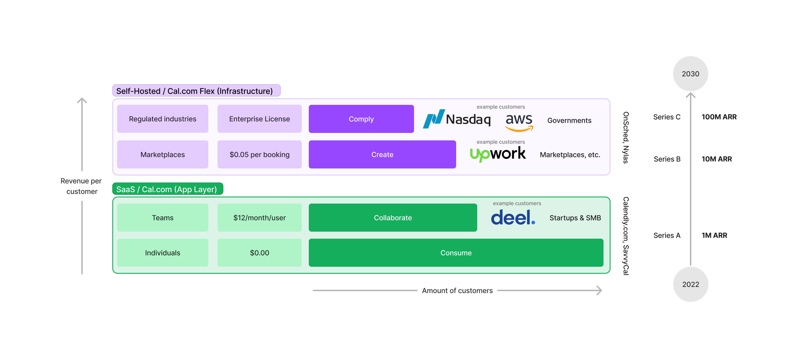

# ❓ What is Cal.com?

### General

From the very first day, [Cal.com](http://cal.com/) started to connect 1 billion people by 2031. We fundamentally believe **infrastructure software** needs to be open, accessible, and here to stay. To achieve this, we started out as an open-source company from its inception.

Being open-source has a lot of tradeoffs. It’s been an incredible growth journey so far thanks to its word-of-mouth nature and developer interest, but OSS is known for making it hard to capture the generated value early on.

A SaaS business can capture a higher % of revenue per customer, but ultimately they will be capped by the people they can reach. Governments, Healthcare, and other highly regulated industries not only prefer but are often required to self-host.

Our hunch is that proprietary SaaS alternatives are only scratching the surface of the scheduling space and CEOs in the space believe that the entire market is still in its infancy.

Competing with incumbents as a SaaS business ourselves seems like a stupid idea, hence we try to do something similar but in a fundamentally different market segment: Open Source.

SaaS companies are much closer to pure sales companies than tech companies. It’s primarily about increasing revenue through **maximising value capturing**.

While every company's purpose is to make money, we fundamentally believe it’s never the goal, but the side-effect of having an amazing product, in a massive market, with viral network effects and a strong moat to defend your position.

This is why our roadmap is to create **as much value** as possible and capture a small amount of it down the road from enterprise deals. Something that closed-source SaaS businesses have a hard time capturing due to its proprietary code-base that cannot be easily self-hosted or audited.

**Value creation vs value capturing:** If a SaaS competitor has 10M customers and charges 30% of them, our goal is to have 1B customers and charge 1% of them.

Keep that in mind when thinking about how we monetize features and sell to customers.

To achieve this, we’re looking to build infrastructure for the masses and not for the niches. It may mean being light on some niche features that other competitors provide, in order to be more accessible to the entire market. We hope these missing features will be built by third-party engineers and launched in our upcoming App Store.

MRR may be a great metric to show initial interest and retention, but the reason why we’ve raised $32.4M in funding was to give this vision the runway that it deserves and buy us time to focus on value creation and not value capturing.

### Competitive Landscape

Calendly is not the only player in the scheduling game. There is SavvyCal, TidyCal, zcal, Motion, Cron, and more.

**None of these competitors are relevant to us as they all focus on a B2C consumer SaaS market and do not focus on an infrastructure approach.**

### Short-term

After reading this, you may think the correct thing is to immediately focus on the tail-end of the market: enterprise and sell self-hosted & infrastructure plans. After all, that’s likely a great strategy to bring in thousands of new users via a single deal.

While we initially thought the same, we’ve come to the conclusion that B2C bottom-up growth (i.e. people signing up for [cal.com/username](http://cal.com/username)) is the most relevant strategy for us going forward in the short term.

**Here’s why:** A single active customer shares their link about 50-100 times in the first 6 months. If only 10% of the link receivers sign up for their own account, that’s an`R0`of 5 to 10 new users per active customer.

A high percentage of these new customers are developers or technical decision-makers. These people become the best salespeople and evangelists in their existing organizations, whether it's a startup or fortune500 company.

We’re already seeing companies reach out for an infrastructure plan after one of their employees has been a power user of the hosted [Cal.com](http://cal.com/) plan.

### Long-term

Scheduling is really hard and really important. Without a doubt, we can be charging enterprise businesses anywhere from $150,000 to multiple million dollars a year for providing proper infrastructure.

While these deals would be amazing to close early on, we’re still early into the product journey and have not built out enough enterprise features and stability bug fixes to confidently sell into the market.

Other companies may also be afraid to sign a multi-year contract with a young startup. Understandably.

Time will help us build reputation, trust, and evangelists who sell from within the organization. That’s the plan.

#### TLDR:

* revenue is great, but not the immediate north-star to optimize for
* build an army of evangelists
* turn scheduling into a commodity and become the market owner
* focus on the [cal.com/username](http://cal.com/username) customer experience first
* sell into Fortune500 companies later to capture value
* base your decision around: “how can this what I’m working on reach more people”
